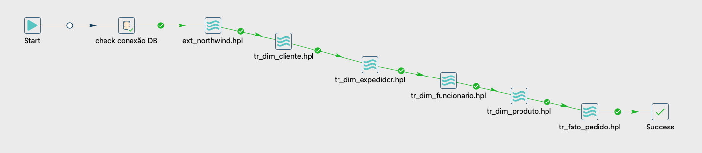

# Objetivo do Projeto

Este projeto nasceu da curiosidade em explorar a ferramenta de ETL, Apache Hop (um potente fork do projeto Kettle/Pentaho), e recursos do Metabase, ferramenta open source de data visualization.

Para validar essa stack, estruturei um projeto de BI ponta a ponta utilizando a clássica base de dados Northwind. A arquitetura foi fundamentada nas boas práticas de Kimball, garantindo um fluxo robusto: desde a extração das fontes transacionais, passando pela transformação e carga (ETL), até a estruturação do Data Warehouse e a entrega de indicadores estratégicos.

# Tecnologias Utilizadas

- SQL Azure onde os dados do northwind foram armazenados;
- RDS-Postgres(AWS) para fazer a cópia e transformação dos dados para o schema de staging(stg) e data warehouse(dw) sucessivamente;
- Apache Hop em servidor local como ferramenta de ETL;
- Metabase hospedado em uma instância EC2 da Amazon;
- Crontab para rodar o workflow do Apache Hop periódicamente;

# Workflow

O workflow é composto pelos seguintes pipelines:
- [ext_northwind](imagens/extracao.png);
- [tr_dim_cliente](imagens/tr_dim_cliente.png)
- [tr_dim_expedidor](imagens/tr_dim_expedidor.png);
- [tr_dim_funcionario(vendedor)](imagens/tr_dim_funcionario.png);
- [tr_dim_produto](imagens/tr_dim_produto.png);
- [tr_fato_pedido](imagens/tr_fato_pedido.png)

# Camada de BI

Ainda seguindo a metodologia do Kimbal, as tabelas foram separadas em:

- Dimensões
  - Dim_Cliente
  - Dim_Expedidor
  - Dim_Produto
  - Dim_Funcionario

- Fato
  - Dim_Pedido

## Indicadores

